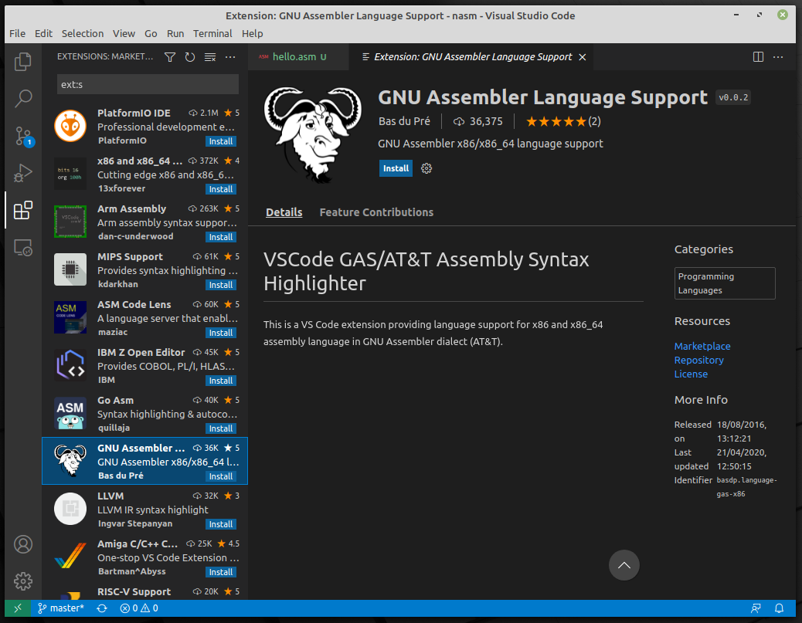
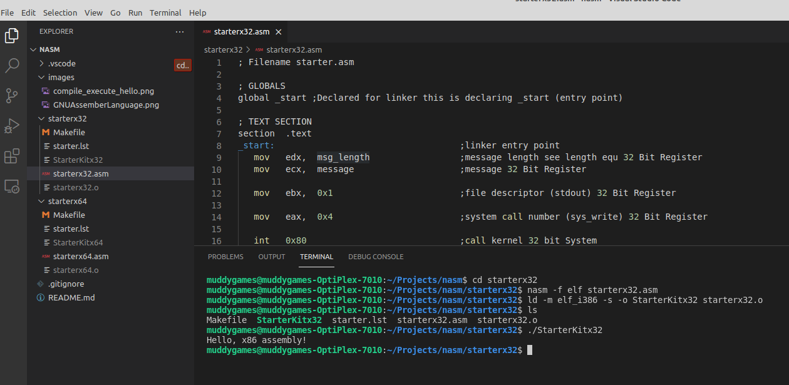
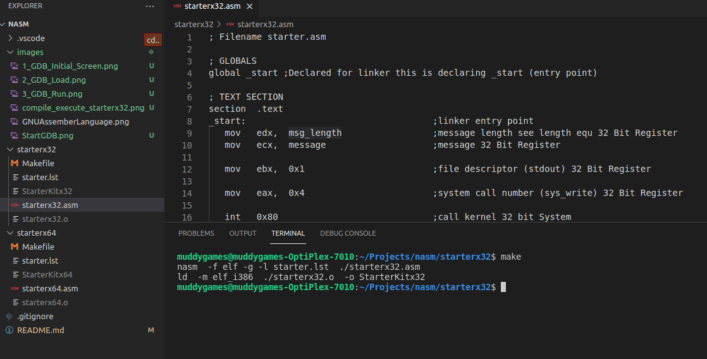
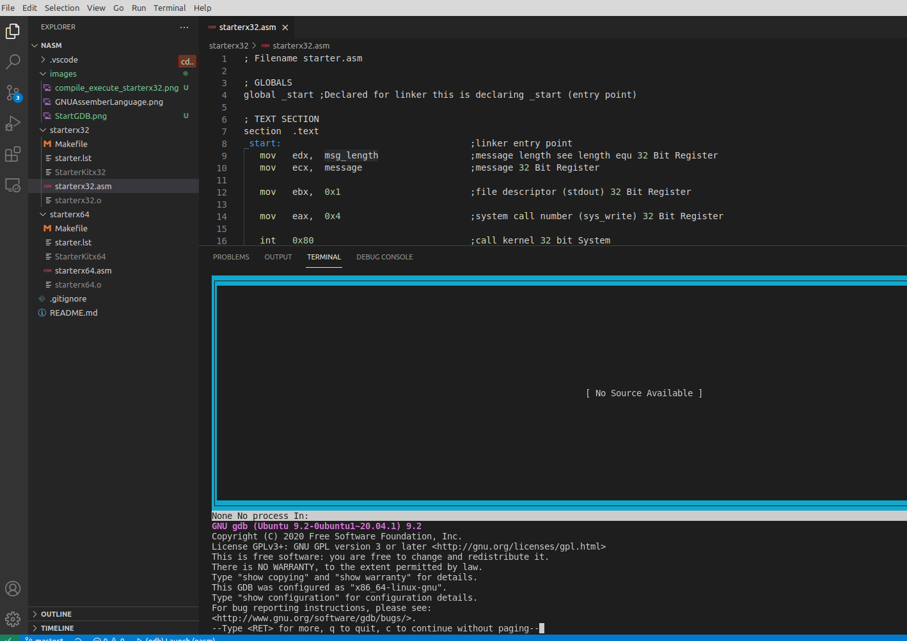
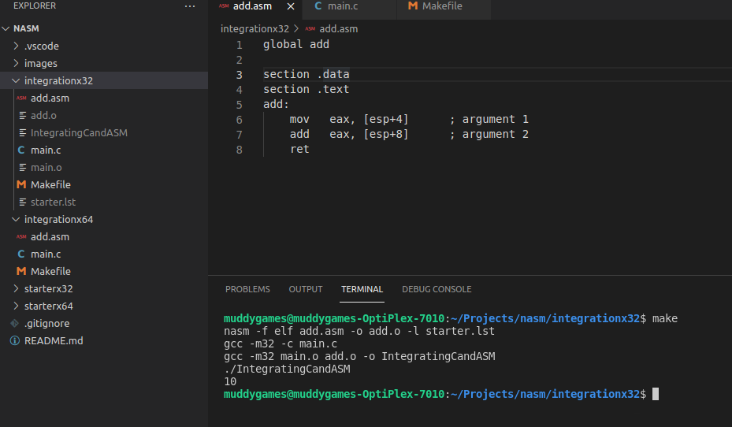

# README #

Getting Started with NASM and x86

### How do I get set up? ###

* Install [Visual Studio Code]("https://code.visualstudio.com/")
* Install [GNU Assembler Language Support]("https://marketplace.visualstudio.com/items?itemName=basdp.language-gas-x86")
  
* Install NASM Linux `sudo apt-get install nasm` or Windows [Version 2.15.05 Win x64](https://www.nasm.us/pub/nasm/releasebuilds/2.15.05/win64/)
* Navigate to *starterx32* folder
* On Linux compile using `nasm -f elf starterx32.asm`
* Object file starterx32.o will be created
  
* Link the Object File using `ld -m elf_i386 -s -o StarterKitx32 starterx32.o`
* Execute program in therminal using `./StarterKitx32`
* Deployment instructions

### GDB Commands
* Run `make` 
 
* Start GDB Debugger with `gdb ./EXECUTABLE_NAME -tui` e.g `gdb ./StarterKitx64 -tui`. Make sure to use make as it has `-g` gdb debugging turned on. 
 
* When GDB Loads you can start entering the following commands 
 
* `break _start` sets a breakpoint at _start  
 
* `run` loads the machine code, stops at _start
* `info registers` show registers and their contents
* `layout asm` shows the assembly file 
 
* If [TUI](https://sourceware.org/gdb/onlinedocs/gdb/TUI-Commands.html#TUI-Commands) is started by makefile asm code can be displayed with `layout asm`
* Registers can be shown with `layout regs`
* `stepi` steps through the code and shows register changes / updates
* `print $rax` will print the contents of the `rax` register
* To exit debugger use `CTRL+C CTRL+z`
* To try out C to ASM Integration example 
    * install 32 bit libraries using command `sudo apt-get install gcc-multilib`
    * Navigate to directory and type `make`
     

### Who do I talk to? ###

* philip.bourke@itcarlow.ie

### Reading materials

* [Using 64-bit Windows Assembly Language from Microsoft Visual Studio](https://www.cs.uaf.edu/2017/fall/cs301/reference/nasm_vs/)
* [Makefile Example NASM](https://gist.github.com/hleonps/d2d1cb335ac8919991dc9a09954be7e8)
* [Running nasm and gdb](https://www.csee.umbc.edu/portal/help/nasm/nasm.shtml)
* [Assembly Programming](https://www.tutorialspoint.com/assembly_programming/)
* [Introduction to 80x80 Assembly Language and Computer Architecture](https://www.jblearning.com/catalog/productdetails/9781284036121)